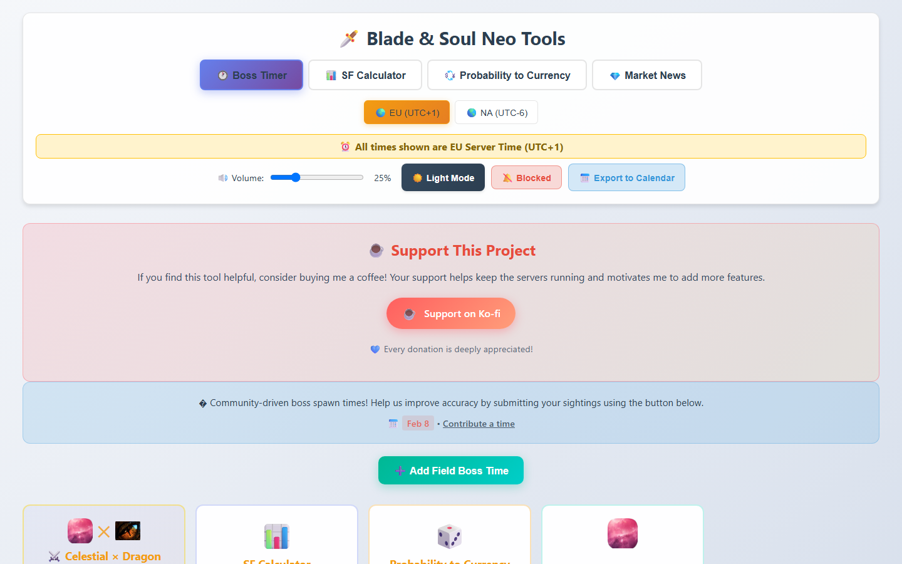
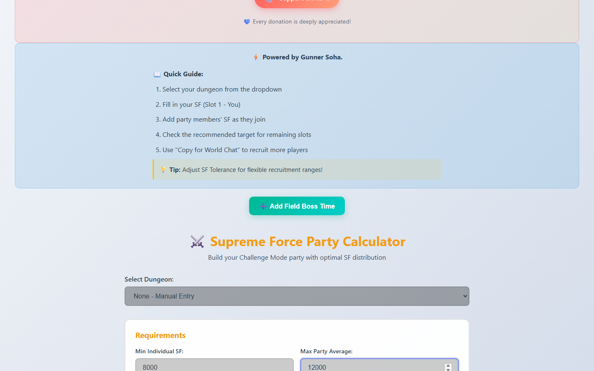
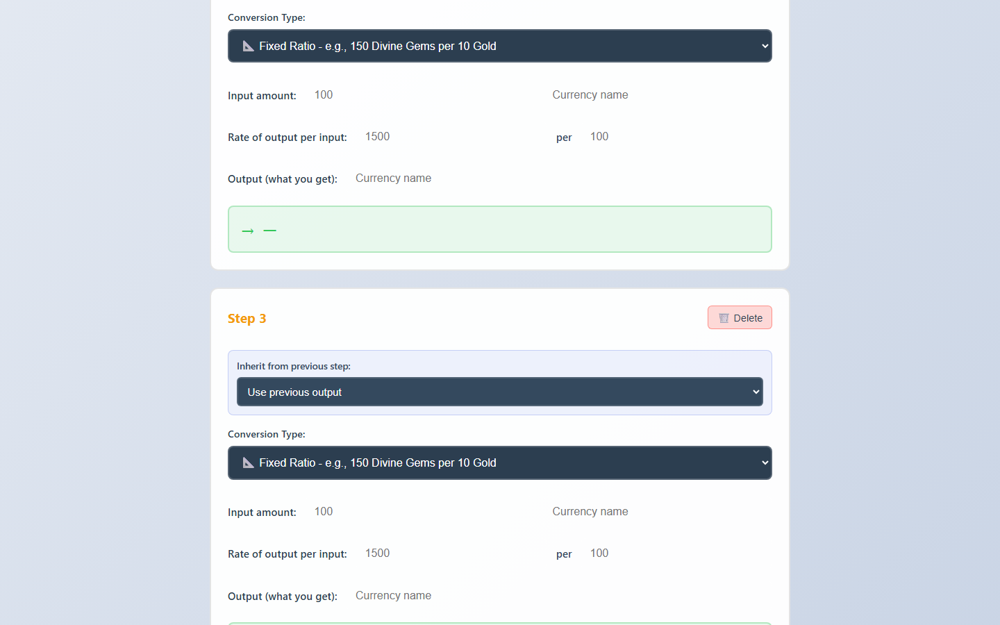
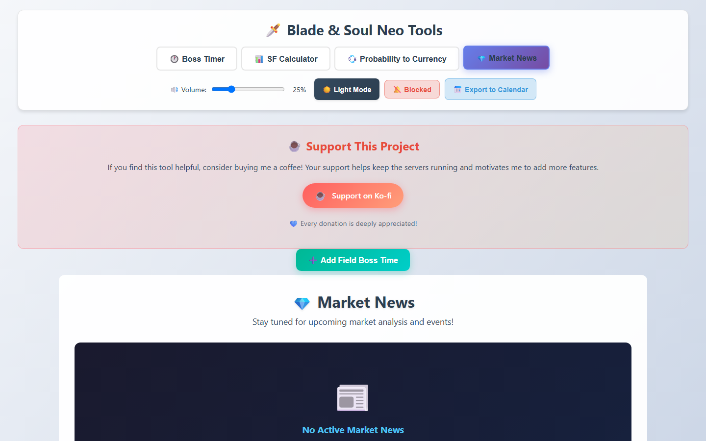
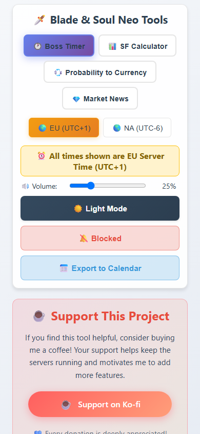
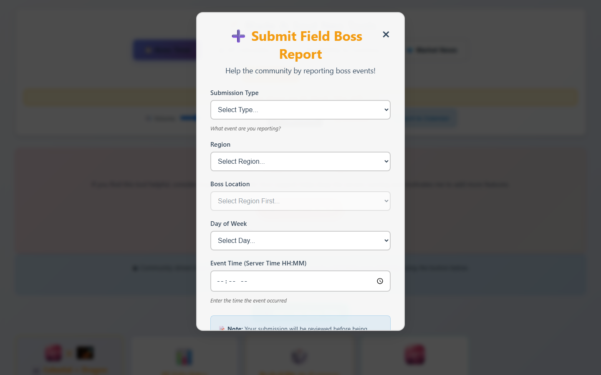
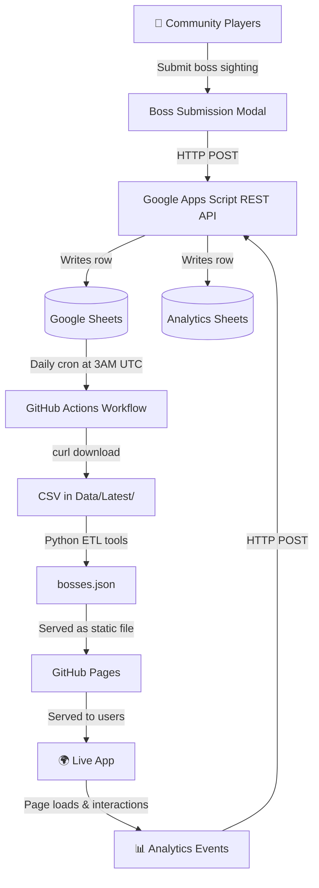

# 🗡️ BNS Neo Community Tools

[](https://hayderch.github.io/bns-neo-boss-timer/)
[](https://hayderch.github.io/bns-neo-boss-timer/)
[](LICENSE)
[](https://github.com/HayderCH/bns-neo-boss-timer/commits/main)
[](https://search.google.com/search-console)
[](/.github/workflows/backup-sheets.yml)

> **Unofficial fan-made community tools for Blade & Soul Neo — EU & NA servers.**  
> Built by [Hayder (Kindle)](https://github.com/HayderCH) and used by the real EU and NA BNS Neo communities. Fully free, no ads, no server required.
>
> *Blade & Soul Neo is a property of NCSOFT. This is an unofficial community tool not affiliated with or endorsed by NCSOFT.*

---

## 🌐 Live App

**→ [hayderch.github.io/bns-neo-boss-timer](https://hayderch.github.io/bns-neo-boss-timer/)**

- Deployed on **GitHub Pages** (free, zero infrastructure cost)
- **Google Search Console** verified — fully indexed and searchable
- **PWA** — install it on mobile or desktop like a native app
- Used by the **EU and NA BNS Neo communities**

---

## 📸 App Screenshots

| Boss Timer (EU) | SF Calculator | Probability Converter |
|---|---|---|
|  |  |  |

| Market News | Mobile View | Boss Submission Modal |
|---|---|---|
|  |  |  |

---

## 🛠️ Tools

| Tab | Description |
|---|---|
| 🕐 **Boss Timer** | Real-time field boss countdowns for EU (UTC+1) and NA (UTC-6) servers. Alarm at 5-min mark, browser push notifications, ICS calendar export. |
| 📊 **SF Calculator** | Supreme Force party composition calculator. Select a dungeon, fill in party members' SF scores, get recruitment messages ready to paste in world chat. |
| 💱 **Probability to Currency** | Multi-step probability chain calculator. Convert drop rates to expected gold cost, compare farming routes, expose predatory gacha pricing. |
| 💎 **Market News** | Market event analysis and gem-to-gold tracking. Extensible for future patch event coverage. |

---

## 🏗️ Engineering Highlights

This project demonstrates engineering skills across multiple disciplines using **zero-cost, serverless infrastructure**.

### 🖥️ Frontend Engineering

| Feature | Tech |
|---|---|
| Real-time timer loop (1s tick) | Vanilla JS `setInterval`, UTC offset math for dual-timezone support |
| Progressive Web App (PWA) | Service Worker, Cache API, Web App Manifest — works fully offline |
| Audio alert system | Web Audio API, volume control, per-boss alarm logic |
| Browser push notifications | Web Notifications API with permission flow |
| ICS calendar export | Client-side `.ics` file generation for Google Calendar / Outlook |
| Dark / Light theme | CSS custom properties + `localStorage` preference persistence |
| Skeleton loading states | CSS animations + Intersection Observer for progressive rendering |
| Cache-busting | Inline version check in `<head>` + Service Worker unregister on version mismatch |
| Maintenance mode flag | Feature flag pattern — disables timer rendering during patch updates |

### ⚙️ Backend Engineering (Serverless)

| Feature | Tech |
|---|---|
| Custom analytics REST API | **Google Apps Script** web app — CORS-compliant JSON endpoint you write and deploy |
| Analytics event ingestion | POST requests from client → GAS → Google Sheets storage |
| Boss time submission backend | Form data → GAS backend → moderation queue → `bosses.json` pipeline |
| Offline event queue | `localStorage`-backed queue, auto-flushes when connection restores |

### 🔄 Full Stack

| Feature | Description |
|---|---|
| Analytics tracker class | OOP JavaScript class (`AnalyticsTracker`) with rate limiting, retry logic (exponential backoff), offline queue, configurable event types |
| Community submission flow | Frontend form → GAS REST API → Google Sheets → manual review → Python ETL → `bosses.json` → GitHub Pages |
| Version management | Semantic versioning (`v1.9.0`) propagated through HTML cache-busting query strings and Service Worker lifecycle |

### 🔧 Data Engineering

| Feature | Tech |
|---|---|
| Automated daily backup | **GitHub Actions** cron (3 AM UTC) → `curl` downloads Google Sheet → commits CSV to repo |
| Git-versioned data history | Every community submission is preserved in git history — fully auditable |
| Python ETL pipeline | `merge_patch.py`, `apply_safe_patch_to_bosses.py`, `check_patch_vs_bosses.py` — safe merge with conflict detection and rollback |
| CSV Ingestor (web UI) | `ingestor.html` — browser-based CSV → JSON converter with validation |
| JSON schema with metadata | `bosses.json` includes `confidence` scores (0–100), `verified` flags, and `location` metadata per spawn entry |

See [`Data/README.md`](Data/README.md) for the full pipeline diagram.  
See [`tools/README.md`](tools/README.md) for the Python ETL scripts.

### 📊 Data Science

| Feature | Description |
|---|---|
| Statistical spawn analysis | [`Data/Analysis/boss_timer_analysis.ipynb`](Data/Analysis/boss_timer_analysis.ipynb) — Jupyter notebook analyzing community-submitted spawn times |
| Confidence scoring | Algorithm assigning 0–100 confidence to each spawn time based on number of independent sightings and consistency with known intervals |
| Pattern detection | Day-of-week spawn pattern analysis, location frequency analysis |
| Data quality pipeline | Outlier detection, duplicate filtering, cross-reference validation |

---

## 🏛️ Architecture



---

## 📁 Project Structure

```
├── index.html              # Main app — 4 tabs, modals, PWA shell
├── script.js               # Core logic: timer engine, SF calculator, probability converter
├── styles.css              # Full responsive CSS with dark/light theme variables
├── dungeons.js             # Dungeon preset data for SF Calculator
├── bosses.json             # Production boss spawn data (structured JSON with metadata)
├── ingestor.html           # Browser-based CSV → JSON converter tool
├── sw.js                   # Service Worker for offline/PWA support
├── manifest.json           # PWA web app manifest
├── sitemap.xml             # SEO sitemap (Google Search Console)
├── robots.txt              # SEO crawling rules
├── analytics/
│   ├── config.js           # Analytics configuration (endpoints, event types, rate limits)
│   └── tracker.js          # AnalyticsTracker OOP class (rate limiting, retry, offline queue)
├── tools/
│   ├── merge_patch.py      # CSV → JSON merge tool
│   ├── apply_safe_patch_to_bosses.py  # Safe patching with backup + rollback
│   ├── apply_proposed_entries.py      # Apply reviewed community proposals
│   └── check_patch_vs_bosses.py       # Conflict detection before patching
├── Data/
│   ├── Latest/             # Most recent community Google Sheet export
│   ├── Backups/            # Daily automated CSV backups
│   ├── Submissions/        # Raw community boss time reports
│   ├── Processed/          # Reviewed and merged CSVs
│   ├── Archives/           # Historical patch data
│   └── Analysis/
│       └── boss_timer_analysis.ipynb  # Jupyter: statistical spawn analysis
├── assets/                 # Audio alerts, icons, promotional images
├── docs/                   # Internal planning documents and feature specs
└── .github/workflows/
    └── backup-sheets.yml   # GitHub Actions: daily Google Sheets → CSV backup
```

---

## 💰 Infrastructure Cost

**Total monthly cost: \$0** 🎉

| Service | Cost | Usage |
|---|---|---|
| GitHub Pages | Free | Unlimited static hosting |
| GitHub Actions | Free | 2000 min/month (daily backup uses ~2 min) |
| Google Apps Script | Free | Custom REST API backend |
| Google Sheets | Free | Data storage + analytics backend |
| Google Search Console | Free | SEO indexing and monitoring |
| Web APIs (PWA, Notifications, Audio) | Free | Native browser features |

---

## 🚀 Setup & Deployment

### Running Locally

```bash
git clone https://github.com/HayderCH/bns-neo-boss-timer.git
cd bns-neo-boss-timer
python -m http.server 3000
# Open http://localhost:3000
```

### Deploying to GitHub Pages

1. Push to GitHub
2. Go to **Settings → Pages**
3. Set source: **main** branch, **/ (root)** folder
4. Live at `https://yourusername.github.io/bns-neo-boss-timer/`

### Updating Boss Data

**Option 1 — CSV Ingestor (recommended for large updates)**:
1. Open `ingestor.html` in your browser
2. Paste community CSV data
3. Convert to JSON → copy → save as `bosses.json`

**Option 2 — Python ETL tools**:
```bash
python tools/check_patch_vs_bosses.py   # Validate first
python tools/apply_safe_patch_to_bosses.py --patch Data/Latest/BNS_NEO_fb_times_EU.csv
```

**Option 3 — Manual edit** `bosses.json` directly (see `Data/README.md` for schema)

---

## 🙏 Community

This tool was built for and by the BNS Neo community:
- Used by **EU and NA server players**
- Community-driven boss spawn data submitted by players
- Ko-fi supported — [buy me a coffee ☕](https://ko-fi.com/hayderch) to keep the tools going!

---

## 📄 License

MIT License — free to fork, adapt, and build upon.

---

*Blade & Soul Neo is a property of NCSOFT. This is an unofficial fan-made community tool, not affiliated with or endorsed by NCSOFT.*
